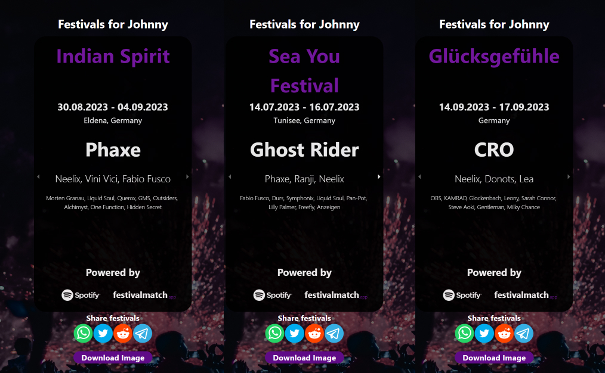

# festivalmatch.app

### A React/Python Application giving you personalized festival suggestions

Finding good festivals is hard. but with festivalmatch it's easier than ever! Simply sign in using your Spotify account and it'll give you the best festivals in your area, according to your taste in music.

## How does it work?

Festivalmatch uses your favourite artists and songs to rank festivals by how similar their lineup is to your music taste. 
Every festival in our database is given a score, based on the following algorithm:
- A festival earns points for every artist of your top 50 attending. The higher the artist in your ranking, the higher the points received. Your top 10 artists scores are doubled, as their assumed to have a very high impact on whether or not a festival is interesting for you.
- A festival earns points for each artist attending that has a track in your top 50. A single festival can earn these points multiple times per artist. For Example: if an artist that has 2 tracks in your top 50 is attending a festival, it receives these points 2 times, for three tracks in your top 50, three times etc.
- Festivals scores are discounted the further the festival is away. For this, your rough geolocation is estimated. This discount rate is large for smaller distances, and changes only marginally for longer distance. So the difference between two festivals that are 200km and 500km away from you is larger than the differences between two festivals that are 1200km and 1500km away.

## Tech Stack
For this project, the following tech stack was used:

### Frontend
- Typescript
- ReactTS
- Bootstrap

### Backend
- Python 3.10
- FastAPI
- NumPy/Pandas
- PeweeORM
- PostgresSQL
- Docker
- nginx
- Cloudflare

### Festival Data Cleaning
- Python 3.10
- Beautifulsoup4
- Spotify Developer API
- Pandas/NumPy

## Questions?
Feel free to reach out! johnnyhagenkessler@gmail.com